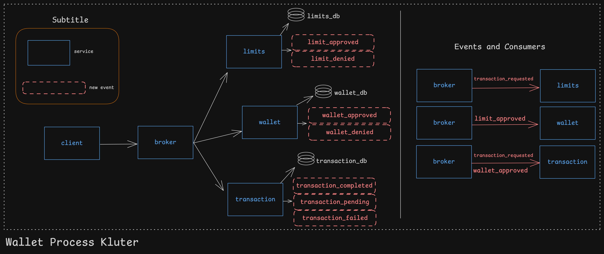

# 💳 Wallet – Sistema Distribuído de Carteira Digital (Arquitetura Hexagonal)

## Visão Geral

Este projeto é um showcase arquitetural, criado para demonstrar pensamento de engenharia de software aplicado a um domínio financeiro.

O objetivo não é entregar um sistema de carteira pronto para produção, mas sim ilustrar como uma arquitetura distribuída e orientada a eventos pode ser desenhada para lidar com:

- movimentação de saldo
- ciclo de vida de transações
- validação de limites
- consistência eventual
- isolamento de domínios
  
O foco está em limites claros, orquestração explícita e fluxo de eventos, e não em complexidade de infraestrutura.

## Fluxo do Processo

## Contexto do Problema

Uma fintech precisa oferecer uma carteira digital que suporte:

- débito e crédito de saldo
- limites diários e mensais
- rastreabilidade de transações
- consistência entre múltiplos serviços
- escalabilidade e desacoplamento

Esse problema é intencionalmente modelado como múltiplos serviços independentes, cada um sendo dono de uma parte específica do domínio. 

Cada microsserviço foi separado por pastas dentro do mesmo repositório com o objetivo de facilitar a visualização do todo e a análise arquitetural.

Em um cenário mais próximo de produção, esses serviços poderiam ser extraídos para repositórios independentes, cada um com seu próprio Dockerfile, permitindo versionamento, deploy e escalabilidade isolados.

A infraestrutura poderia ser composta por containers orquestrados via Docker Compose (ou Kubernetes), incluindo um API Gateway como ponto de entrada, balanceamento de carga entre instâncias e ferramentas de observabilidade e métricas, como Prometheus.

## Objetivos Arquiteturais

- Separação clara de responsabilidades
- Limites de domínio bem definidos
- Orquestração explícita
- Sincronização de estado via eventos
- Ausência de acoplamento implícito (ex: banco compartilhado)
- Tratamento de sucesso e falha

## Serviços e Responsabilidades
#### 🔹 Serviço de Pagamento (Orquestrador)

- Ponto de entrada para requisições de pagamento
- Coordena o fluxo
- Chama outros serviços de forma síncrona quando uma decisão imediata é necessária
- Não executa movimentação de dinheiro

### Responsabilidades:

- Orquestrar o fluxo de pagamento
- Gerar o transaction_uuid
- Coordenar limites, registro da transação e execução na carteira

#### 🔹 Serviço de Limites

- Dono das regras de limite (diário / mensal)
- Valida se um pagamento é permitido
- Não executa pagamentos
- Não orquestra outros serviços

Princípio-chave:
Limites validam decisões, não executam ações.

Modelo de resposta:
HTTP 200 quando a avaliação ocorre corretamente

A decisão de negócio vem no corpo da resposta

{
  "allowed": true
}

ou

{
  "allowed": false,
  "reason": "DAILY_LIMIT_EXCEEDED"
}

#### 🔹 Serviço de Transações

- Dono do ciclo de vida da transação
- Registra transações como PENDING
- Atualiza o status com base em eventos
- Não executa operações de carteira

Princípio-chave:

Transações representam intenção e resultado, não execução.

#### 🔹 Serviço de Wallet (Domínio Financeiro Central)

- Fonte única da verdade para movimentação de dinheiro
- Executa débito e crédito
- Garante atomicidade entre débito e crédito
- Emite eventos que representam fatos já ocorridos

Princípio-chave:
Quem move o dinheiro é dono da verdade.

#### 🔹 Statements / Read Models

- Consomem eventos
- Constroem visões otimizadas para leitura
- Não participam de decisões de negócio
- Fluxo de Requisição → Evento

O sistema segue um fluxo explícito e previsível:

Cliente
 → Serviço de Pagamento
   → Serviço de Limites (validação síncrona)
   → Serviço de Transações (registro PENDING)
   → Serviço de Wallet (execução débito/crédito)
     → Eventos emitidos
       → Transações atualizam status
       → Limites atualizam uso
       → Statements atualizam visões

### Por que Algumas Chamadas São Síncronas

Chamadas HTTP síncronas são usadas apenas quando uma decisão imediata é necessária, como:

- validação de limites
- registro da intenção da transação

Isso evita o uso de eventos para decisões que exigem resposta imediata.
Eventos são usados para comunicar fatos, não para fazer perguntas.

### Eventos como Fatos

Eventos são emitidos somente após execução e persistência bem-sucedidas.

Exemplo:

{
  "type": "WalletDebited",
  "wallet_id": "b1e7...",
  "transaction_uuid": "9f32...",
  "amount": 100
}

Esses eventos representam fatos consumados, não comandos.

Os consumidores reagem de forma independente.

### Atomicidade e Consistência

Operações de carteira são executadas dentro de uma transação de banco de dados, garantindo que:
- débito e crédito ocorram juntos
- nenhum estado parcial seja persistido
- eventos só sejam emitidos após commit

Ou toda a operação é bem-sucedida, ou nada acontece.

## Filosofia de Tratamento de Erros

- Exceções representam falhas inesperadas ou estados inválidos
- O fluxo normal não depende de exceções
- Decisões de negócio são explícitas
- A camada de API traduz exceções em respostas HTTP
- Exceções não são controle de fluxo.
- Eventos não são comandos.

## Decisões de Design e Trade-offs

Este projeto simplifica intencionalmente alguns aspectos para manter o foco na arquitetura:
- Não há broker de mensagens real (Kafka é representado conceitualmente)
- Não há retry automático ou idempotência completa
- Não há outbox pattern
- Não há orquestração distribuída via saga

Em um sistema de produção, esses pontos seriam tratados com infraestrutura adicional.

Este repositório tem como objetivo demonstrar:
- raciocínio arquitetural
- compreensão de sistemas distribuídos
- uso correto de comunicação síncrona vs assíncrona
- limites claros de domínio
- princípios de consistência financeira

Ele não foi projetado para ser implantado diretamente em produção.

## Principais Aprendizados

- Orquestração pertence à camada de aplicação
- Movimentação financeira deve ser atômica
- Eventos representam fatos, não intenções
- Domínios não devem orquestrar outros domínios
- Fluxos explícitos são melhores que acoplamentos implícitos

## Nota Final

Este projeto prioriza clareza de design em vez de completude de infraestrutura.
Cada simplificação foi feita de forma intencional.
